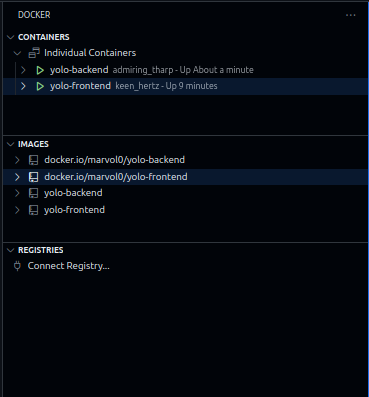
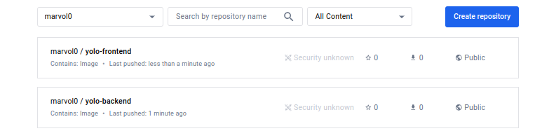
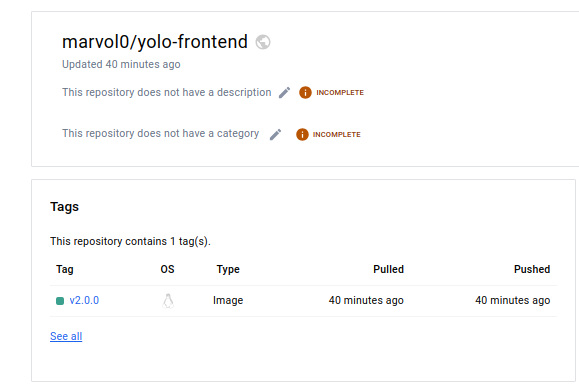
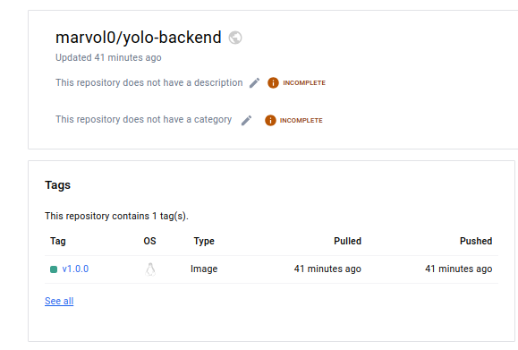

# Week 4 IP 2
- List of objectives required to meet completion:
  - [x] Choice of the base image on which to build each container
  - [x] Dockerfile directives used in the creation and running of each container
  - [ ] Docker-compose Networking (Application port allocation and bridge implementation) where necessary
  - [ ] Docker-compose volume definition and usage (where necessary)
  - [x] Git workflow used to achieve the task
  - [ ] Successful running of the applications and if not, debugging measures applied
  - [x] Good practices such as Docker image tag naming standards for ease of identification of images and containers
  - [x] There is a screenshot of your deployed image on DockerHub, clearly showing the version of the image

 ### Set up:
1. Created a Mongo database and successfully added a product to the database

2. Added a product to the website, testing the basic functionality

### Tasks
1. Settled on an image after using node version manager and running through the versions from 20 - 13, also derived it from the list of versions from the package-lock.json used at the time of project creation
`nvm ls-remote` - lists the available node.js versions
`nvm install 13` - choose the version from the list and installs it
'nvm use 13' - switch to the installed version
- Based on the above, settled on the base image to use to build the containers.

2. Directives
- FROM: specifies the base image that will be used for building the Docker image. It defines the starting point for your Dockerfile
- RUN: executes shell commands during the image build process
- COPY:  directives copy files or directories from the host into the image during the build process.
- CMD: specifies the command that should be executed when a container is run from the built image
- WORKDIR: sets the working directory within each stage of the build. This allows subsequent instructions to operate relative to this directory
- EXPOSE: informs Docker that the container listens on specific network ports at runtime. It does not actually publish the ports
- as build: alias assigned to reference the build from when implementing multi-stage
- COPY --from=build /app/client/package.json /app/client/package-lock.json ./: Copies package.json and package-lock.json from the build stage's working directory (/app/client) into the current stage's working directory (/app/client). This ensures that the production image has the necessary dependency metadata.

3. Bridge Network
- Containers are connected to a bridge network `yolo-net` defined in the docker-compose file.

4. List of built and tagged images of the containers built and their respective sizes

- Installed Docker extension on VS studio to view the condition of images and containers built i.e. running or stopped

5. DockerHub
- Screenshot of pushed images on dockerhub

