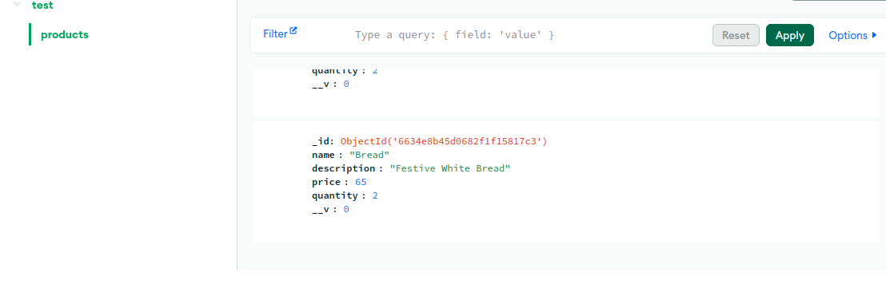
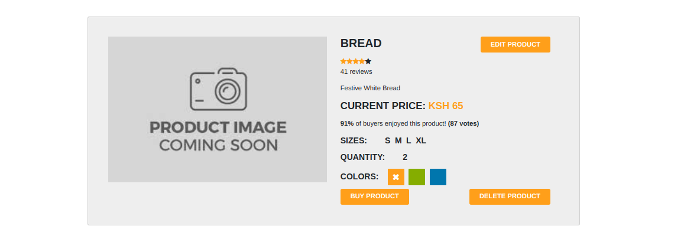

# Week 4 IP 2
- List of objectives required to meet completion:
  - [ ] Choice of the base image on which to build each container
  - [ ] Dockerfile directives used in the creation and running of each container
  - [ ] Docker-compose Networking (Application port allocation and bridge implementation) where necessary
  - [ ] Docker-compose volume definition and usage (where necessary)
  - [ ] Git workflow used to achieve the task
  - [ ] Successful running of the applications and if not, debugging measures applied
  - [ ] Good practices such as Docker image tag naming standards for ease of identification of images and containers
  - [ ] There is a screenshot of your deployed image on DockerHub, clearly showing the version of the image

 ### Set up:
1. Created a Mongo database and successfully added a product to the database

2. Added a product to the website, testing the basic functionality

### Tasks
1. 
